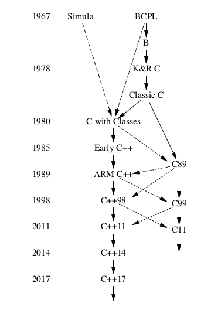

# Lecture 12: April 20 2020

## Concurrency continued

### Waiting

[`condition_variable.cpp`](condition_variable.cpp)

- `mutex` allows us to block until an exclusive resource (the `mutex`) is available. But what if we want to wait for something more complex?
  - We could just use a loop to continually check the condition: `while (condition = false) {} // afterwards condition must be true!`
  - This is both inefficient (wasting CPU time) and doesn't work (the condition may change back to false if we don't guard the condition with a `mutex`, and we never release the `mutex` if we do guard the condition).
- `condition_variable`s are a synchronization primitive used for threads to sleep until another thread wakes it up, based on some _condition_.
- `condition_variable` must be used with a `mutex`.
  - The waiting `thread` acquires the `mutex` using a `unique_lock`, then calls `.wait()` on the `condition_variable`. `.wait()` will release the lock and suspend the `thread` until it is woken up.
  - To wake up threads waiting on `condition_variable`s, a `thread` that changes the condition can call `.notify_one()` or `.notify_all()` to wake up one or all waiting `thread`s on that `condition_variable`.
  - When a thread wakes up, it must acquire the lock again to leave the `.wait()`.
- `condition_variable` uses `unique_lock` instead of `scoped_lock` because we need finer control of the lock. `scoped_lock` just locks on construction and unlocks on destruction. `unique_lock` provides methods to lock and unlock at any time.
- `.wait()` can take a second argument, a predicate that represents the condition to check.
  - This is to combat _spurious wakeup_, where suspended threads can just wake up randomly, for no reason.
  - Typically the `wait` is wrapped in a while loop: `while (!condition) cv.wait(...);`.
  - This overload of `.wait()` does this for you, the predicate is checked and if it is not true, we wait again.
    - Note that since `.wait()` needs to acquire the lock, the predicate is guarded by the lock as well.

### C++20

- C++20 will add some other common synchronization primitives: semaphores and barriers.

### Back to execution policies

[`execution.cpp`](execution.cpp)

- We are responsible for avoiding data races and deadlocks when using parallel algorithms (`execution::par`)
- When using vectorized algorithms (`execution::par_unseq`), statements can be _interleaved at compile time_, so that operations from different iterations can be optimized to run in the same thread. This means that any operation that depends on timing or ordering cannot be used.
  - This includes `new`/`delete` and `mutex` operations.
  - I couldn't get this to fail however, which may be because the compiler is too smart (recognizes the mutex and falls back to `execution::par`) or because it's too dumb (can't vectorize the operations properly).
- Note that to sum up a container in parallel without synchronization we can use `reduce`, which is `accumulate` (a fold in functional programming) that can be performed out of order.

## Alternatives to various C patterns

### `std::optional`

- A common pattern in C is using return codes, like the following:

```c++
int * p = get_memory(...);
if (p)
    ...
else
    // error
```

[`optional.cpp`](optional.cpp)

- In <optional>
- Holds either a value or nothing.
- `{}` or `nullopt` is an empty optional<T>
- Can use an implicit conversion to `bool` or `has_value` to check if an `optional` holds a value.
- Use `value` to access the value, with an exception if no value exists.
- Use `value_or` to access the value, with a default value passed in to return if no value exists.
- Use `*` and `->` to access the value directly (without any check or exception), as if it was a pointer.

### `std::variant`

[`variant.cpp`](variant.cpp)

- C provides `union`s, a type that holds one of several types. In C this is typically used to access the same bytes using different types.
  - The built-in `union` is _untagged_. It does not store which of the possible types it is.
- C++ provides a _tagged_ union type, `variant`.
- Use `holds_alternative` to check which one of its alternatives a `variant` holds.
- Use `get<T>` to get one of its alternatives.

### `std::any`

- An alternative to `void *`.
- Use `any_cast<T>` to try to cast an `any` into a `T`.

## Casts

- We talked about `dynamic_cast` before, for casting within a class hierarchy. The cast is checked at runtime (dynamically), returning `nullptr` or throwing an exception if it fails.
- There are also other types of casts. Often they are something to avoid, and can be avoided by a different design.

[`static_cast.cpp`](static_cast.cpp)

- `static_cast` performs "safe" casts, such as those between numeric types, and upcasts in a class hierarchy. The compiler checks that the types are convertible to each other at compile-time (statically).
  - `static_cast` can also be used to perform downcasts, but these are not checked like `dynamic_cast` is. Use this if you need the performance, and are _sure_ that it will succeed (e.g. if you have already checked using a `dynamic_cast`)

[`const_cast.cpp`](const_cast.cpp)

- `const_cast` removes `const` from a reference or pointer. Note that you can always add `const` without a cast.
- However, if the original object is `const`, modifying it is undefined behavior.

[`reinterpret_cast.cpp`](reinterpret_cast.cpp)

- `reinterpret_cast` changes a pointer or reference type without any checking. It interprets the argument just as a pointer/reference to a sequence of bytes and just gives it the new type.
  - `reinterpret_cast` cannot remove `const`, you need to use `const_cast` for that.

- You should never use C-style casts (`(int)v`) in C++! They behave in often unexpected ways. It performs (approximately) `const_cast`, `static_cast`, `static_cast` then `const_cast`, `reinterpret_cast`, and `reinterpret_cast` then `const_cast` until one of them succeeds.

## Design of C++

- Zero-overhead abstractions
  - If you don't use an abstraction (e.g. exceptions, virtual calls), you should not have to pay for them.
  - Abstractions (e.g. classes, threads, exceptions, etc.) should not have any more overhead than implementing them manually.
- Direct map to hardware
  - C++ operations directly map to hardware operations. e.g. `vector` is just a contiguous block of memory, like an array. Arithmetic operations map directly to the assembly instructions. This can cause issues like `%` with negative numbers, which may differ in behavior based on platform.

## History of C++

- For context, other popular current languages: C (1972), Bash (1989), Python (1989), Haskell (1990), Java (1995), JavaScript (1995), PHP (1995), OCaml (1996), C# (2000), Scala (2003), Go (2009), Rust (2010), TypeScript (2012)

### Early C++

- 1979: "C with Classes" at Bell Labs by Bjarne Stroustrup.
  - Wanted to write distributed cluster code using OOP abstractions from [Simula](https://en.wikipedia.org/wiki/Simula) and using the low-level hardware and concurrency support from C.
- 1984: Renamed to C++
- At this point, C++ had most of its OOP features, `const`, function and operator overloading, references, and virtual functions.
- Notably added constructors (first time a language had support for multiple constructors) and destructors (first time ever) for resource management.
- C++ also had streams, complex numbers, and vectors at this time.
- 1991: Added templates and exceptions, and introduced the RAII idiom.

### Standardization of C++

- 1987: discussion begins about standardizing the language.
- 1991: ISO C++ committee created: known as WG (working group) 21.
- 1993: STL (standard template library) submitted for standardization.
  - A library that included most of the containers (`vector`, `list`, `map`, etc.), iterators and algorithms in the standard library today.
  - You may hear the STL name used frequently still. This usually refers to the C++ standard library, but strictly speaking it refers to the original library from the 90s. I personally don't like using the term and say "standard library" or something similar instead.
- 1998: C++98 standard published.
- 2003: C++03 standard published, "bug-fix" standard to C++98.

### "Modern" C++

- 2011: C++11 standard published. This added things like move semantics, `auto`, range-based for loops, lambdas, concurrency, and many other features.
  - C++11 was originally supposed to be released in the late 2000s, so you may see it referred to in older documentation as C++0x (if we use hexadecimal, it's C++0B).
  - C++11 was a huge update to C++. The main goals were to make C++ better for systems programming and building libraries, and to make it easier to teach and learn.
- A policy of updates every 3 years was adopted, with updates alternating between minor and major.

- 2014: C++14 standard published. This update was fairly small and added mostly minor improvements.
- 2017: C++17 standard published. This update added a filesystem library, parallel algorithms, `variant`, among other topics.
  - C++17 was not the major update that was hoped for. C++20 is expected to be the major update.

- What _is_ modern C++? Prominent members of the C++ community are working on the [C++ Core Guidelines](https://isocpp.github.io/CppCoreGuidelines/CppCoreGuidelines), a set of rules and rationales for them.

### C and C++

- Neither of C nor C++ are a strict subset of the other. They are really more siblings than ancestors.


Picture from "A Tour of C++, 2nd Edition" by Bjarne Stroustrup.

- e.g. variable names from C may be keywords in C++.
- e.g. in C `void *` can be implicitly converted to any pointer type. In C++ it cannot.
- e.g. Linking object files is different in C and C++, since C++ has function overloading and C does not.
  - A C++ function can be given C linkage (to be used in a C program) by declaring it with `extern "C"` at the front.
- Coding style is very different.
  - Use `string` and its member functions instead of `char *` and `strcmp`, `strcpy`, etc.
  - There are many alternatives to macros, like `const`, `constexpr`, `inline`, templates, etc. in C++.
  - `new` and `delete` instead of `malloc` and `free`.
  - Avoid `void *` and casts, and if needed, use other types like `any`.
  - Use a named cast (`static_cast`, `dynamic_cast`, etc) instead of C-style casts to be precise about your intent.
  - Use abstractions like iterators instead of pointer arithmetic.
- Note that you should avoid writing "C/C++" on your resume or other documents. At this point you should see that C and C++ are very different languages!
